## Pembahasan Praktikum Instalasi dan Konfigurasi Git

Folder ini berisi dokumentasi proses instalasi Git for Windows versi 2.56.0.2
serta konfigurasi awal Git. Setiap gambar menunjukkan tahapan atau pilihan
konfigurasi yang dilakukan selama proses tersebut.

### Gambar 1 — Persetujuan lisensi GNU GPL

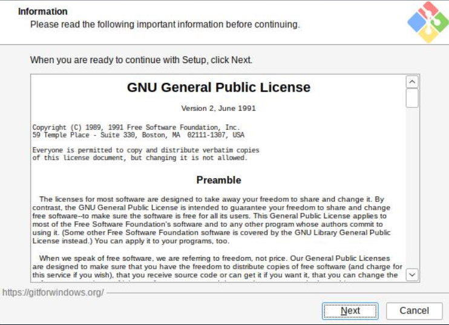

Gambar `instalgit01.png` menampilkan halaman informasi lisensi GNU General
Public License (GPL) versi 2. Lisensi ini menjelaskan bahwa Git dapat
digunakan, dipelajari, disalin, dan didistribusikan secara bebas sesuai
ketentuan lisensi. Tombol **Next** digunakan untuk menyetujui dan melanjutkan
proses instalasi.

### Gambar 2 — Pengaturan perilaku `git pull`

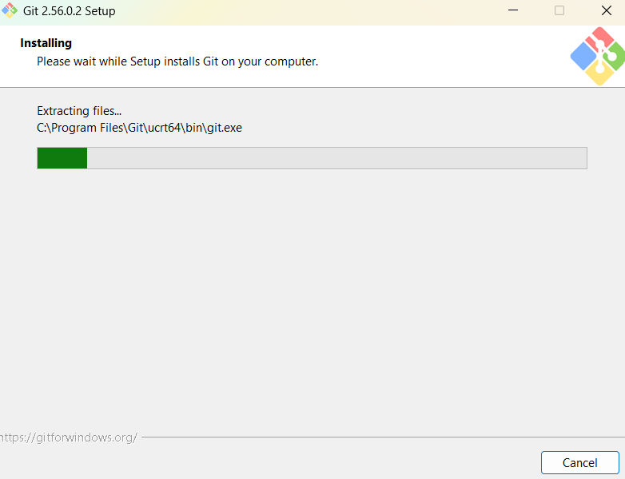

Gambar `instalgit02.png` menunjukkan perilaku bawaan perintah `git pull` yang
dipilih, yaitu **Fast-forward only**. Dengan pilihan ini, `git pull` hanya
berhasil apabila branch lokal dapat maju langsung mengikuti branch remote.
Git akan membatalkan operasi apabila diperlukan merge atau terdapat riwayat
yang bercabang, sehingga perubahan riwayat tidak terjadi secara otomatis dan
potensi konflik dapat dikendalikan.

### Gambar 3 — Pemilihan terminal Git Bash

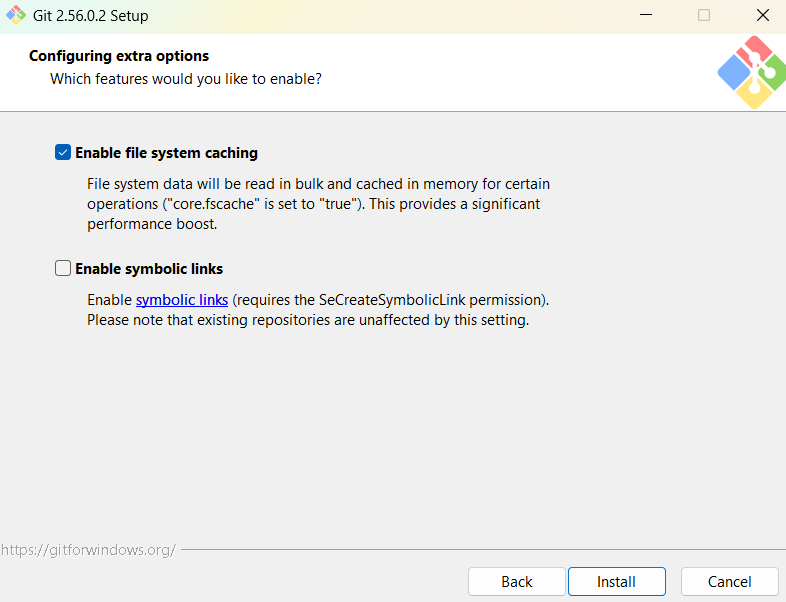

Gambar `instalgit03.png` memperlihatkan konfigurasi terminal **Use MinTTY**.
MinTTY dipilih sebagai terminal bawaan Git Bash karena mendukung pengubahan
ukuran jendela, pemilihan teks yang lebih fleksibel, dan tampilan karakter
Unicode yang lebih baik dibandingkan konsol Windows lama.

### Gambar 4 — Pemilihan pustaka HTTPS

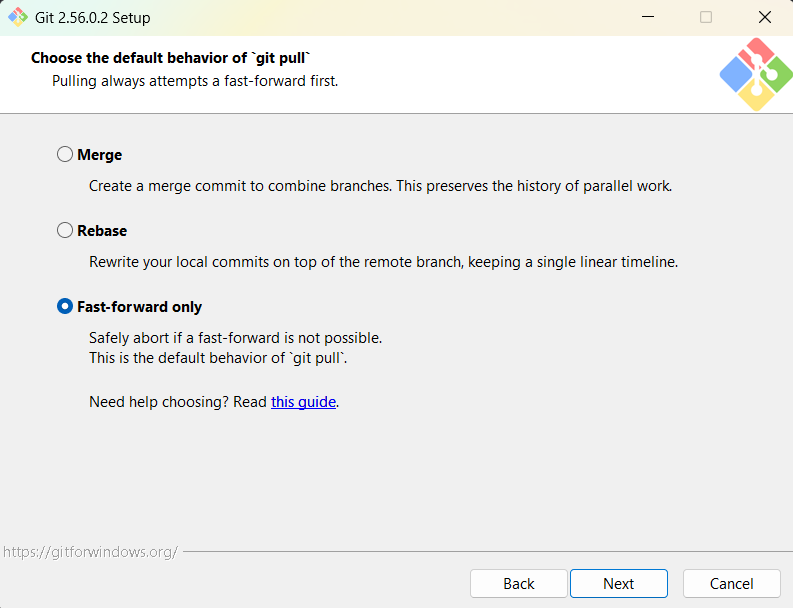

Gambar `instalgit04.png` menampilkan pilihan pustaka untuk koneksi HTTPS.
Pilihan yang aktif adalah **native Windows Secure Channel library**. Dengan
pilihan ini, validasi sertifikat server menggunakan penyimpanan sertifikat
Windows. Hal tersebut memudahkan integrasi dengan sertifikat internal
perusahaan atau jaringan yang dikelola melalui Windows.

### Gambar 5 — Pemilihan SSH eksternal

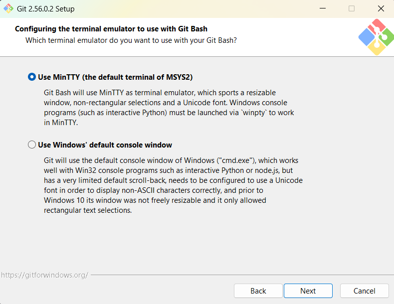

Gambar `instalgit05.png` menunjukkan opsi **Use external OpenSSH**. Opsi ini
menggunakan program OpenSSH yang sudah tersedia di sistem dan ditemukan
melalui variabel lingkungan `PATH`. Pilihan ini berguna apabila pengguna
sebelumnya telah memiliki konfigurasi SSH tersendiri, tetapi dapat menimbulkan
masalah apabila program atau konfigurasi SSH tidak ditemukan dengan benar.

### Gambar 6 — Pemilihan SSH bawaan Git

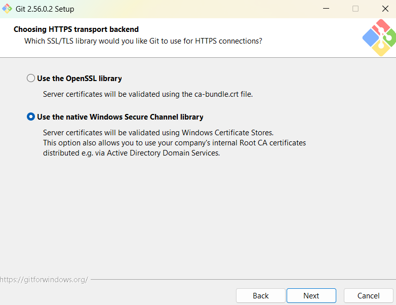

Gambar `instalgit06.png` menunjukkan pilihan **Use bundled OpenSSH**. Pilihan
ini menggunakan program `ssh.exe` yang disertakan bersama Git. Penggunaan SSH
bawaan membuat instalasi lebih mandiri karena Git tidak bergantung pada
instalasi OpenSSH lain yang mungkin sudah ada di komputer.

### Gambar 7 — Proses instalasi

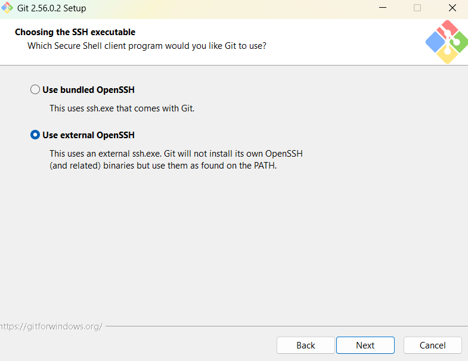

Gambar `instalgit07.png` menampilkan proses pemasangan Git yang sedang
berlangsung. Installer sedang mengekstrak berkas program, salah satunya
`git.exe`, ke direktori instalasi. Progress bar menunjukkan bahwa proses
instalasi sedang berjalan dan pengguna perlu menunggu sampai selesai sebelum
melakukan konfigurasi lanjutan.

### Gambar 8 — Pengaturan fitur tambahan

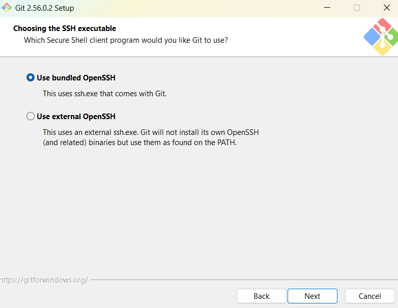

Gambar `instalgit08.png` menunjukkan fitur tambahan yang akan diaktifkan.
**File system caching** dipilih untuk meningkatkan kinerja operasi Git dengan
membaca data sistem berkas secara berkelompok dan menyimpannya sementara di
memori. **Symbolic links** tidak dipilih, sehingga pembuatan tautan simbolis
tidak diaktifkan secara khusus dan tidak membutuhkan izin tambahan.

### Gambar 9 — Pengaturan PATH

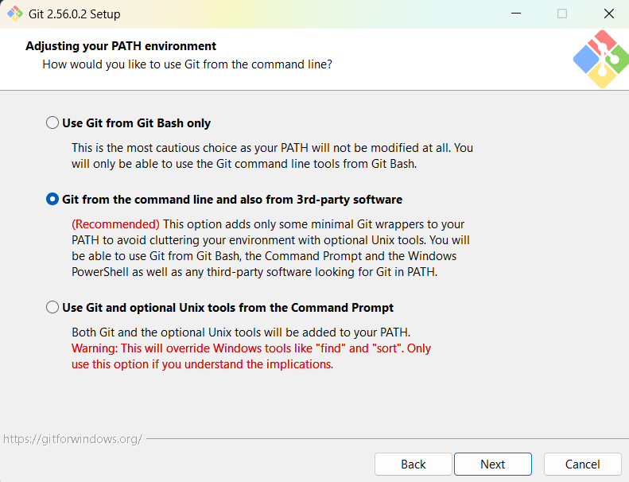

Gambar `instalgit09.png` menampilkan pengaturan **PATH** dengan pilihan
**Git from the command line and also from 3rd-party software**. Konfigurasi
ini memungkinkan perintah Git digunakan dari Git Bash, Command Prompt,
PowerShell, maupun perangkat lunak pihak ketiga tanpa menambahkan seluruh
peralatan Unix ke PATH Windows. Pilihan ini merupakan pilihan yang
direkomendasikan karena memberikan akses yang luas dengan risiko konflik yang
lebih kecil.

### Gambar 10 — Penamaan branch awal

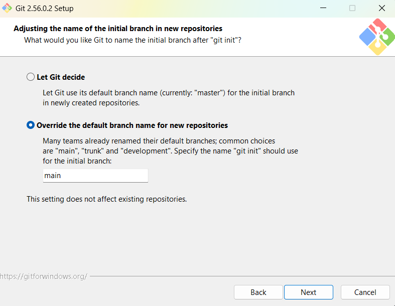

Gambar `instalgit10.png` menunjukkan bahwa nama branch awal untuk repositori
baru diatur menjadi **main**. Pengaturan ini mengikuti konvensi modern yang
banyak digunakan pada layanan repositori dan menghindari penggunaan nama
branch lama `master`. Pengaturan ini hanya berlaku untuk repositori yang
dibuat setelah konfigurasi diterapkan dan tidak mengubah repositori yang sudah
ada.

### Gambar 11 — Pemilihan editor bawaan Git

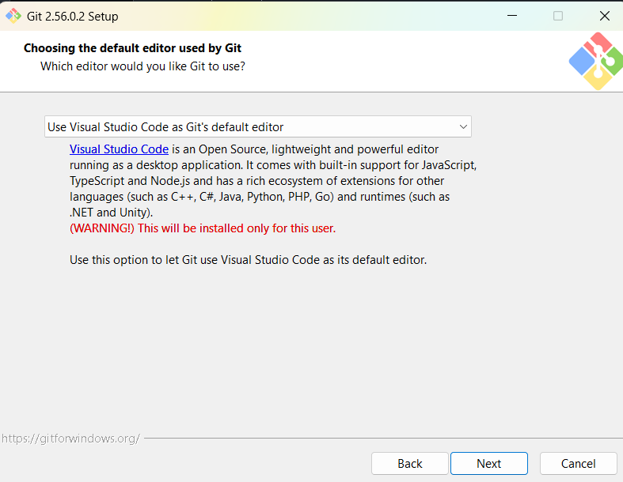

Gambar `instalgit11.png` memperlihatkan Visual Studio Code dipilih sebagai
editor bawaan Git. Dengan konfigurasi ini, Git dapat membuka Visual Studio
Code ketika pengguna perlu menulis pesan commit, menyelesaikan konflik, atau
mengedit berkas konfigurasi. Editor tersebut dipasang dan digunakan untuk
akun pengguna yang sedang melakukan instalasi.

### Gambar 12 — Konfigurasi Git global

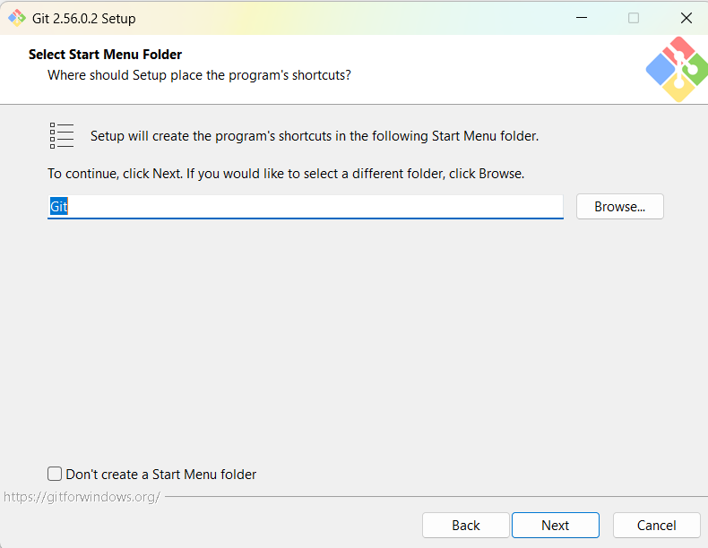

Gambar `instalgit12.png` menampilkan hasil pemeriksaan konfigurasi global Git
melalui perintah `git config --global`. Konfigurasi tersebut menunjukkan bahwa
identitas pengguna untuk commit, branch awal `main`, editor Visual Studio
Code, penyimpanan kredensial, fitur file system caching, serta pengaturan
remote repositori telah tersimpan. Terlihat pula bahwa Git menggunakan
Windows Secure Channel untuk HTTPS dan pengaturan `pull.ff=only` sesuai
dengan pilihan pada tahap instalasi.

### Gambar 13 — Pemilihan folder Start Menu

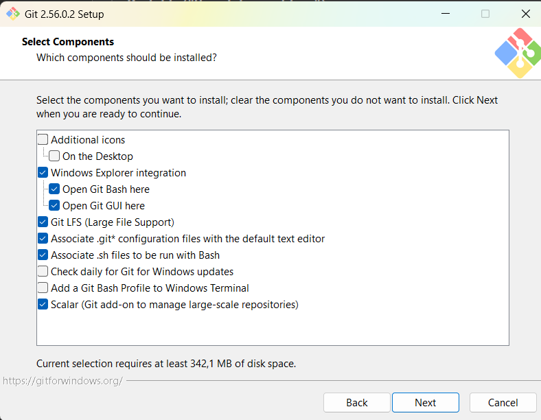

Gambar `instalgit13.png` menampilkan pengaturan folder Start Menu yang akan
digunakan untuk menyimpan pintasan Git. Nama folder yang digunakan adalah
**Git**, sehingga Git Bash, Git GUI, dan pintasan lain dapat ditemukan dengan
mudah melalui Start Menu Windows.

### Gambar 14 — Pemilihan komponen Git

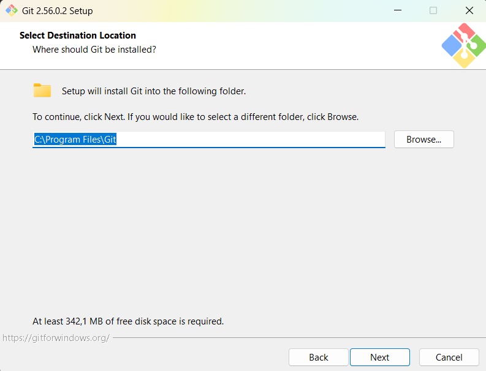

Gambar `instalgit14.png` menampilkan komponen yang akan dipasang. Komponen yang
dipilih mencakup integrasi Git dengan Windows Explorer, Git LFS untuk menangani
berkas berukuran besar, asosiasi berkas konfigurasi Git, serta Scalar untuk
repositori berskala besar. Integrasi **Open Git Bash here** dan **Open Git GUI
here** memudahkan pengguna membuka Git langsung dari suatu folder.

### Gambar 15 — Penentuan lokasi instalasi

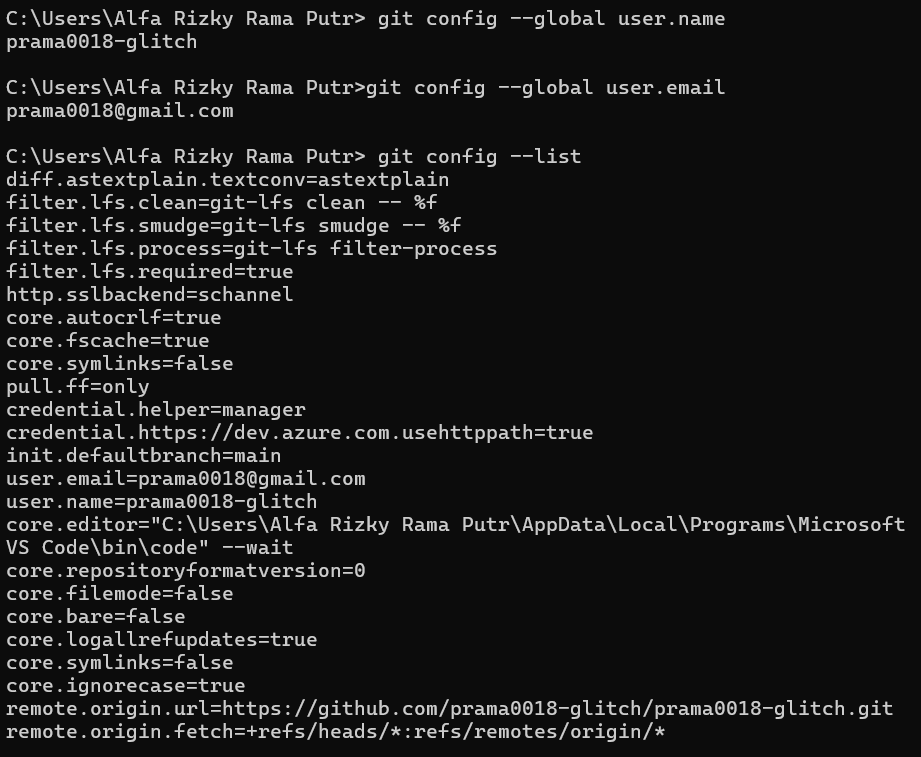

Gambar `Config.png` menunjukkan lokasi pemasangan Git, yaitu
`C:\Program Files\Git`. Lokasi tersebut merupakan lokasi standar pada Windows
dan membuat berkas program Git tersimpan secara teratur di direktori Program
Files. Pengguna juga dapat memilih lokasi lain melalui tombol **Browse**.

### Kesimpulan

Berdasarkan seluruh gambar, proses instalasi Git for Windows telah dilakukan
secara bertahap mulai dari persetujuan lisensi, pemilihan komponen, penentuan
lokasi instalasi, konfigurasi SSH, HTTPS, terminal, PATH, branch awal, dan
editor. Setelah instalasi selesai, konfigurasi global Git diperiksa untuk
memastikan identitas pengguna dan preferensi kerja telah tersimpan. Git
kemudian siap digunakan untuk membuat repositori, melakukan commit, serta
berkomunikasi dengan repositori remote melalui HTTPS.